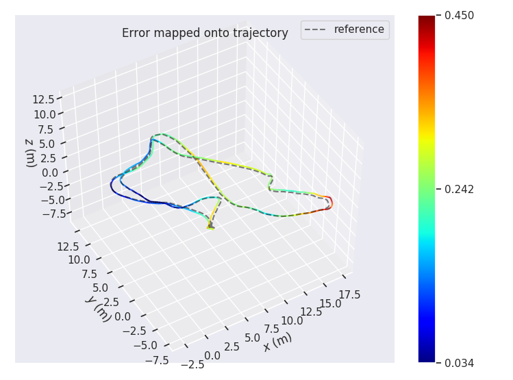

# My VINS project
[  ](README_EN.md)

**Project**：
The work of this project based on the paper of VINS-Mono (https://github.com/HKUST-Aerial-Robotics/VINS-Mono). But we don't use ROS, Ceres, G2o. I implement the back end with Eigen, use the LM algorithmus，sliding window algorithmus，robust kernel function and so on.
It can used in Ubuntu.

### Installation：

1. pangolin: <https://github.com/stevenlovegrove/Pangolin>

2. opencv

3. Eigen

4. Ceres: the initialization of the system use ceres to optimise the sfm，so we also need to installe ceres. 

### Build

```c++
mkdir build 
cd build
cmake ..
make -j4
```

### Process
#### 1. CurveFitting Example to Verify Our Solver.
```c++
cd bin
./testCurveFitting 
```

#### 2. VINs-Mono on Euroc Dataset
```c++
cd bin
./run_euroc /home/dataset/EuRoC/MH-05/mav0/ ../config/
```


#### 3. VINs-Mono on Simulation Dataset (project homework)

you can use this code to generate vio data.

```c++
https://github.com/chengKID/VIO_Data_Simulation_ROS.git
```

#### 4. Validation Results
[evo package](https://github.com/MichaelGrupp/evo)
```c++
evo_ape euroc euroc_mh05_groundtruth.csv pose_output.txt -a -p
```



### Licence

The source code is released under GPLv3 license.

